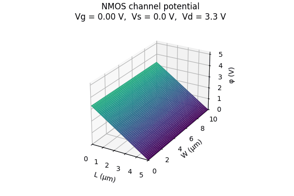

# AITL Animation Demos

This page provides quick access to **experimental animation demos** related to AITL concepts.  
Each demo is self-contained and can be viewed directly in the browser.

---

## 🔗 Links

| Language | GitHub Pages 🌐 | GitHub 💻 |
|----------|----------------|-----------|
| 🇺🇸 English |  |  |

 

---

## CSS-only Demos

- **Orbit Demo (FSM concept)**  
  Conceptual orbit-style animation using pure CSS.  
  👉 [Open demo](./demo/css-only/orbit.html)

- **Fade-in Demo**  
  Simple fade-in animation for step-by-step concept introduction.  
  👉 [Open demo](./demo/css-only/fade-in.html)

- **Pulse Demo (Attention highlight)**  
  Pulse animation to subtly emphasize important elements.  
  👉 [Open demo](./demo/css-only/pulse.html)

- **Layer Stack Demo (AITL layers)**  
  Stacked animation visualizing PID–FSM–LLM layered architecture.  
  👉 [Open demo](./demo/css-only/layer-stack.html)

## JS + SVG Demos

- **AITL Control Flow Demo**  
  PID response → disturbance → FSM detection → LLM gain re-tuning → target re-tracking.  
  👉 [Open demo](./demo/js-svg/aitl-control-flow.html)

- **Inkjet Droplet Formation Demo**  
  Inkjet droplet generation, flight, and satellite formation visualization.  
  👉 [Open demo](./demo/js-svg/inkjet-droplet.html)

---

## NMOS Under-Gate Potential (Vg Sweep)

Electrostatic potential distribution φ(x, y) in the NMOS channel region,
calculated under a fixed source–drain bias (Vs = 0 V, Vd = 3.3 V).

The gate voltage Vg is swept continuously from 0 to 3.3 V and back,
modulating the channel potential profile while maintaining the
source–drain boundary conditions.

The potential φ includes:
- a linear source–drain component along the channel length (L-direction), and
- a gate-induced electrostatic modulation representing the formation
  and strengthening of the inversion layer.

The z-axis is fixed to cover the theoretical maximum potential
(φ ≈ Vd + α·Vg), ensuring consistent visualization without clipping.

Representative frame shown (Vg = 0.3 V).
Time evolution shown over multiple slow sweep cycles.

---

## NMOS Id Surface (Vg–Vd–Id Characteristics)

This animation visualizes the **NMOS drain current surface**
 $ I_d(V_g, V_d) $  under a **3.3 V CMOS operating range**.

- **x-axis**: Drain voltage  $V_d$  (0 → 3.3 V)  
- **y-axis**: Gate voltage  $V_g$  (0 → 3.3 V)  
- **z-axis**: Drain current  $I_d$  

The **origin  $(V_d, V_g) = (0, 0)$  is intentionally placed at the front corner**
to preserve physical intuition:
- zero gate bias and zero drain bias correspond to zero current,
- increasing  $V_g$  enhances channel inversion,
- increasing  $V_d$  transitions the device from the linear region
  to saturation.

### Modeling assumptions

The surface is generated using a simplified long-channel NMOS model:

- Threshold voltage:  $V_\mathrm{th}$
- Square-law behavior:
  - Linear region:  
$$
I_d = K \left[(V_g - V_\mathrm{th}) V_d - \frac{1}{2} V_d^2 \right]
$$
  - Saturation region:  
$$
I_d = \frac{1}{2} K (V_g - V_\mathrm{th})^2
$$

Channel-length modulation and short-channel effects are intentionally
omitted to keep the geometric structure of the surface clear.

### Animation behavior

- The surface is **periodically scaled (0 → max → 0)** to emphasize
  the topology of the $I_d$ surface without changing the bias axes.
- Viewpoint and axis directions are fixed so that:
  -  $(V_d, V_g) = (0,0)$ remains at the front,
  - higher voltages extend toward the back,
  - comparison with electrostatic potential animations is intuitive.

This representation is intended for **educational and architectural
visualization**, not compact model accuracy.

---

## Notes

- These demos are **experimental** and may change without notice.
- Not all demos are intended for adoption into the main portal.
- This page serves as a **navigation hub** only.

---

## 👤 Author

| 📌 Item | Details |
|--------|---------|
| **Name** | Shinichi Samizo |
| **Education** | M.S. in Electrical and Electronic Engineering, Shinshu University |
| **Career** | Former Engineer at Seiko Epson Corporation (since 1997) |
| **Expertise** | Semiconductor devices (logic, memory, high-voltage mixed-signal) Thin-film piezo actuators for inkjet systems PrecisionCore printhead productization, BOM management, ISO training |
| **Email** |  |
| **X (Twitter)** |  |
| **GitHub** |  |

---

## 📄 License

| Item | License | Description |
|------|---------|-------------|
| **Source Code** | MIT | Free to use, modify, redistribute |
| **Text Materials** | CC BY 4.0 / CC BY-SA 4.0 | Attribution & share-alike rules |
| **Figures & Diagrams** | CC BY-NC 4.0 | Non-commercial use |
| **External References** | Original license applies | Cite properly |

---

## 💬　Feedback

> Suggestions, improvements, and discussions are welcome via GitHub Discussions.

