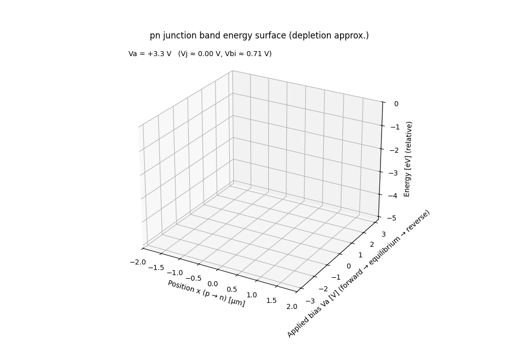
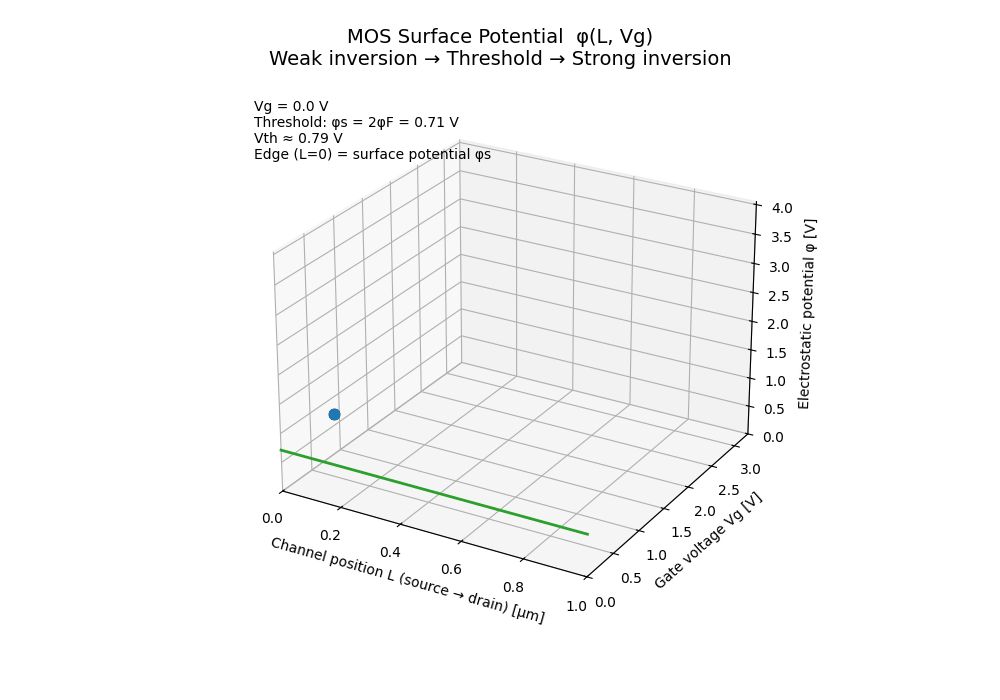
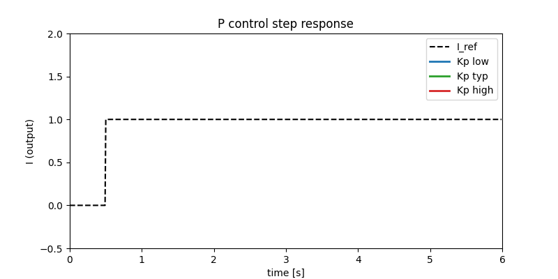
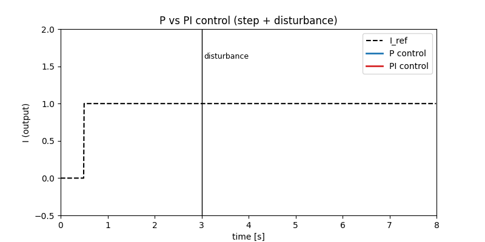
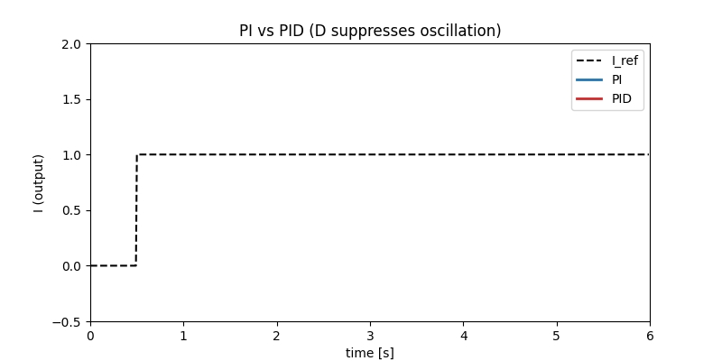

# AITL Animation Demos

This page provides quick access to **experimental animation demos** related to AITL concepts.  
Each demo is self-contained and can be viewed directly in the browser.

---

## 🔗 Links

| Language | GitHub Pages 🌐 | GitHub 💻 |
|----------|----------------|-----------|
| 🇺🇸 English |  |  |

 

---

## CSS-only Demos

- **Orbit Demo (FSM concept)**  
  Conceptual orbit-style animation using pure CSS.  
  👉 [Open demo](./demo/css-only/orbit.html)

- **Fade-in Demo**  
  Simple fade-in animation for step-by-step concept introduction.  
  👉 [Open demo](./demo/css-only/fade-in.html)

- **Pulse Demo (Attention highlight)**  
  Pulse animation to subtly emphasize important elements.  
  👉 [Open demo](./demo/css-only/pulse.html)

- **Layer Stack Demo (AITL layers)**  
  Stacked animation visualizing PID–FSM–LLM layered architecture.  
  👉 [Open demo](./demo/css-only/layer-stack.html)

## JS + SVG Demos

- **AITL Control Flow Demo**  
  PID response → disturbance → FSM detection → LLM gain re-tuning → target re-tracking.  
  👉 [Open demo](./demo/js-svg/aitl-control-flow.html)

- **Inkjet Droplet Formation Demo**  
  Inkjet droplet generation, flight, and satellite formation visualization.  
  👉 [Open demo](./demo/js-svg/inkjet-droplet.html)

---

## PN Junction Band Energy Surface (Bias Sweep)

This animation visualizes the **energy-band surface of a pn junction**
under a continuous **bias sweep from forward to equilibrium to reverse**.

- **x-axis**: Spatial position across the junction  
  *(p-type → n-type)*  
- **y-axis**: Applied junction bias  $V_a$  
  *(forward → equilibrium → reverse)*  
- **z-axis**: Energy (relative, eV)

The band surface is constructed using a **depletion approximation**
to emphasize the *geometric structure* of the electrostatic potential
rather than carrier transport details.

### Physical interpretation

This 3D representation unifies what are traditionally shown as
separate 2D band diagrams:

- **Forward bias**: potential barrier collapses  
- **Equilibrium**: built-in potential forms a stable barrier  
- **Reverse bias**: depletion region widens and deepens  

Any conventional textbook pn-junction band diagram corresponds to
a **2D slice of this surface at a fixed bias**.

Likewise, fixing position and sweeping bias reveals how the
electrostatic barrier evolves continuously—something difficult to
grasp from static figures alone.

### Modeling assumptions

- Abrupt pn junction  
- Uniform doping on both sides  
- Depletion approximation  
- Energy plotted as  
  $E_c(x) \propto -\phi(x)$ (relative scale)

Carrier injection, recombination, and quasi-Fermi level splitting are
intentionally omitted to keep the visualization focused on
**electrostatic structure**.

This animation serves as the **electrostatic foundation**
for the MOS and NMOS visualizations that follow.

---

## MOS Surface Potential (Weak Inversion → Threshold → Strong Inversion)

This animation visualizes the **MOS surface potential**
 $(\phi(L, V_g)$ ) as a continuous function of **channel position** and
**gate voltage**, explicitly connecting:

**weak inversion → threshold → strong inversion**

### Axes definition

- **x-axis**: Channel position  $(L$)  
  *(source → drain)*  
- **y-axis**: Gate voltage  $(V_g$)  
- **z-axis**: Electrostatic potential  $(\phi$)

The potential surface is constructed using a **minimal educational model**
to emphasize physical intuition rather than compact-model accuracy.

### Physical meaning

The total potential is decomposed as:

- a **linear source–drain component** along the channel, and  
- a **gate-controlled surface modulation** that decays away from the source.

The **highlighted edge at  $(L = 0$)** represents the  
**surface potential  $(\phi_s(V_g)$ ) **.

### Threshold definition

The threshold condition is defined geometrically as:

$$
\phi_s = 2\phi_F
$$

- **Weak inversion**:  $(\phi_s < 2\phi_F$)  
- **Threshold (V\_th)**:  $(\phi_s = 2\phi_F$)  
- **Strong inversion**:  $(\phi_s \gtrsim 2\phi_F$)

This makes the threshold voltage **not an abstract parameter**, but a
**visible point on the surface**, determined by the internal electrostatic
state.

### Why this representation matters

Traditional MOS explanations separate:
- surface potential,
- threshold voltage,
- and drain current equations.

This animation unifies them by showing that:

> **Threshold is simply the gate voltage at which the surface potential
> reaches the inversion condition.**

The transition from weak to strong inversion is therefore a **continuous
electrostatic process**, not a sudden event.

---

## NMOS Id Surface (Vg–Vd–Id Characteristics)

This animation visualizes the **NMOS drain current surface**
 $ I_d(V_g, V_d) $  under a **3.3 V CMOS operating range**.

- **x-axis**: Drain voltage  $V_d$  (0 → 3.3 V)  
- **y-axis**: Gate voltage  $V_g$  (0 → 3.3 V)  
- **z-axis**: Drain current  $I_d$  

The **origin  $(V_d, V_g) = (0, 0)$  is intentionally placed at the front corner**
to preserve physical intuition:
- zero gate bias and zero drain bias correspond to zero current,
- increasing  $V_g$  enhances channel inversion,
- increasing  $V_d$  transitions the device from the linear region
  to saturation.

### Modeling assumptions

The surface is generated using a simplified long-channel NMOS model:

- Threshold voltage:  $V_\mathrm{th}$
- Square-law behavior:
  - Linear region:
  
$$
I_d = K \left[(V_g - V_\mathrm{th}) V_d - \frac{1}{2} V_d^2 \right]
$$

  - Saturation region:

$$
I_d = \frac{1}{2} K (V_g - V_\mathrm{th})^2
$$

Channel-length modulation and short-channel effects are intentionally
omitted to keep the geometric structure of the surface clear.

### Animation behavior

- The surface is **periodically scaled (0 → max → 0)** to emphasize
  the topology of the $I_d$ surface without changing the bias axes.
- Viewpoint and axis directions are fixed so that:
  -  $(V_d, V_g) = (0,0)$ remains at the front,
  - higher voltages extend toward the back,
  - comparison with electrostatic potential animations is intuitive.

This representation is intended for **educational and architectural
visualization**, not compact model accuracy.

---

## PID Control: Visual Intuition by Step Response

This section introduces **PID control** using minimal step-response animations.
The goal is not mathematical completeness, but **instant physical intuition**.

We consider a simple control loop where:

- **Control input**: voltage $V$
- **System output**: current $I$
- **Reference**: $I_{\mathrm{ref}}$

The controller computes the control voltage $V(t)$ from the current error:

$$
e(t) = I_{\mathrm{ref}} - I(t)
$$

---

## P Control — Proportional Action

**P control reacts only to the instantaneous error.**

$$
V(t) = K_p \, e(t)
$$

- Large error → large control effort  
- Small error → weak control effort  

As shown below:
- Low $K_p$: slow response
- High $K_p$: fast but overshoots and oscillates
- **Steady-state error always remains**

**Key intuition**  
> P control is fast, but it stops acting once the error becomes small.  
> Precision is impossible with P alone.

---

## PI Control — Eliminating Steady-State Error

**I control accumulates error over time.**

$$
V(t) = K_p e(t) + K_i \int e(t)\,dt
$$

To highlight its role, a disturbance is applied during operation.

Observation:
- P control leaves a permanent offset after disturbance
- PI control **slowly but surely restores the target current**

**Key intuition**  
> I control provides persistence.  
> As long as error exists, it keeps pushing.

---

## PID Control — Damping Oscillation

**D control reacts to the rate of change of the output.**

$$
V(t) = K_p e(t) + K_i \int e(t)\,dt - K_d \frac{dI}{dt}
$$

It acts as a **dynamic brake**, suppressing overshoot and oscillation.

Comparison:
- PI: reaches the target but oscillates
- PID: reaches the target **smoothly and quickly**

**Key intuition**  
> D control anticipates motion and applies braking force.

---

## Summary: Physical Meaning of PID

| Term | Looks at | Physical role |
|----|----|----|
| **P** | Error | Immediate force |
| **I** | Accumulated error | Bias removal |
| **D** | Rate of change | Damping / braking |

**PID control mirrors human motion control**:
- Push toward the target (P),
- Keep pushing if still off (I),
- Brake before overshooting (D).

---

These animations are designed for **architectural understanding**
and control intuition, rather than parameter tuning or model accuracy.

---

## Notes

- These demos are **experimental** and may change without notice.
- Not all demos are intended for adoption into the main portal.
- This page serves as a **navigation hub** only.

---

## 👤 Author

| 📌 Item | Details |
|--------|---------|
| **Name** | Shinichi Samizo |
| **Education** | M.S. in Electrical and Electronic Engineering, Shinshu University |
| **Career** | Former Engineer at Seiko Epson Corporation (since 1997) |
| **Expertise** | Semiconductor devices (logic, memory, high-voltage mixed-signal) Thin-film piezo actuators for inkjet systems PrecisionCore printhead productization, BOM management, ISO training |
| **Email** |  |
| **X (Twitter)** |  |
| **GitHub** |  |

---

## 📄 License

| Item | License | Description |
|------|---------|-------------|
| **Source Code** | MIT | Free to use, modify, redistribute |
| **Text Materials** | CC BY 4.0 / CC BY-SA 4.0 | Attribution & share-alike rules |
| **Figures & Diagrams** | CC BY-NC 4.0 | Non-commercial use |
| **External References** | Original license applies | Cite properly |

---

## 💬　Feedback

> Suggestions, improvements, and discussions are welcome via GitHub Discussions.

